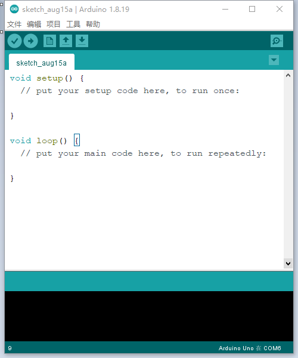
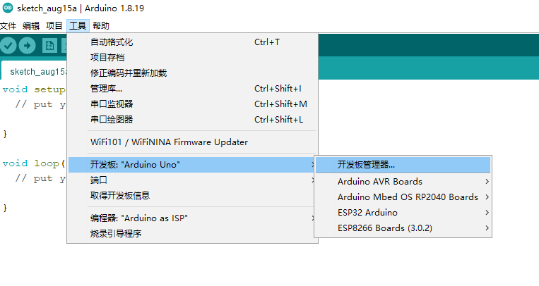

.. _doc_summary_environment_01_arduino ide:

环境搭建——安装Arduino IDE
==================================================

RBZ V1.0的  **主控MCU** （微型计算机）采用的是  **ESP32**，ESP32是一款具备 **WIFI，蓝牙通信功能的双核单片机**，在市面上许多物联网科技产品的主控芯片都采用这款单片机。

.. image:: assets/mcu.png

ESP32的开发方式有三种：

1. 使用 **Arduino IDE** 开发，沿用Arduino C的开发风格， **对初学者友好，开源库众多** 。
2. 使用 **ESP—IDF** 开发，沿用C的开发风格， **可以发挥ESP32全部应用功能，但教程较少，编程过程复杂** 。
3. 使用 **MicroPython** 开发，沿用Python的开发风格，此方式需要先给板子烧写一个特殊的固件， **需要Python基础** 。

所以我们这样的初学者通常会使用Arduino IDE来编写程序，编译，然后上传到RBZ V1.0中并运行程序。

**这一小节将带领你从零开始搭建Arduino IDE的编译环境！**

Windows电脑用户
~~~~~~~~~~~~~~~~~~~~~~~~

安装Arduino IDE
------------------------
登录Arduino `官网 <https://www.arduino.cc/en/software>`_ （https://www.arduino.cc/en/software）下载最新版本的Arduino IDE。

点击 **DOWNLOAD OPRTIONS** 下电脑对应的版本 **（Windows 7以上建议选择红框的选项）**。

.. image:: assets/Arduinodownload.png

点击 **JUST DOWNLOAD** ，开始下载Arduino IDE安装包。

.. image:: assets/Arduinodownload1.png

下载得到arduino-XX.XX.XX-windows.exe（XX.XX.XX为版本号，教程使用1.8.19版本）安装文件，常规点击“下一步”的安装方式安装即可（ **不需要更改任何设置** ）。

电脑桌面显示Arduino IDE图标，并 **双击** 打开。

出现如下图所示编写程序界面，即 **安装成功** 。

安装ESP32开发包
------------------------
因为Arduino IDE默认是给Arduino开发板用的编译器，默认只有Arduino开发板的相关开发资源。 **如果要想在在Arduino IDE中使用ESP32，需要额外安装ESP32的开发包。** 安装方式有两种，一种是在线安装，一种是使用离线包安装。

在线安装
^^^^^^^^^^^^^^^^^^^^^
在线方式需要连网络下载ESP32开发板的安装包，对网络环境要求较高， **但因为经常因网络原因安装失败，可以看下文的离线安装步骤。**

在Arduino IDE软件中下载并安装ESP32开发包，首先是找到菜单里的： **文件->首选项** （或者使用快捷键 Ctrl+逗号）

.. image:: assets/Arduinoideesp32-1.png

在 **附加开发板管理器网址** 中填入以下url：https://raw.githubusercontent.com/espressif/arduino-esp32/gh-pages/package_esp32_index.json

.. image:: assets/Arduinoideesp32-2.png

然后打开： **工具->开发板->开发板管理器**，点击 **开发板管理器**

**输入esp32，查看搜索结果，点击安装。**

.. image:: assets/Arduinoideesp32-4.png

安装完成， **重启Arduino IDE。**
打开 **工具->开发板->**，列表里显示有ESP32 Arduino，则安装成功。并选择开发板为 **ESP32 Dev Module**。

.. image:: assets/Arduinoideesp32-5.png

离线安装
^^^^^^^^^^^^^^^^^^^^^

简单测试程序
------------------------