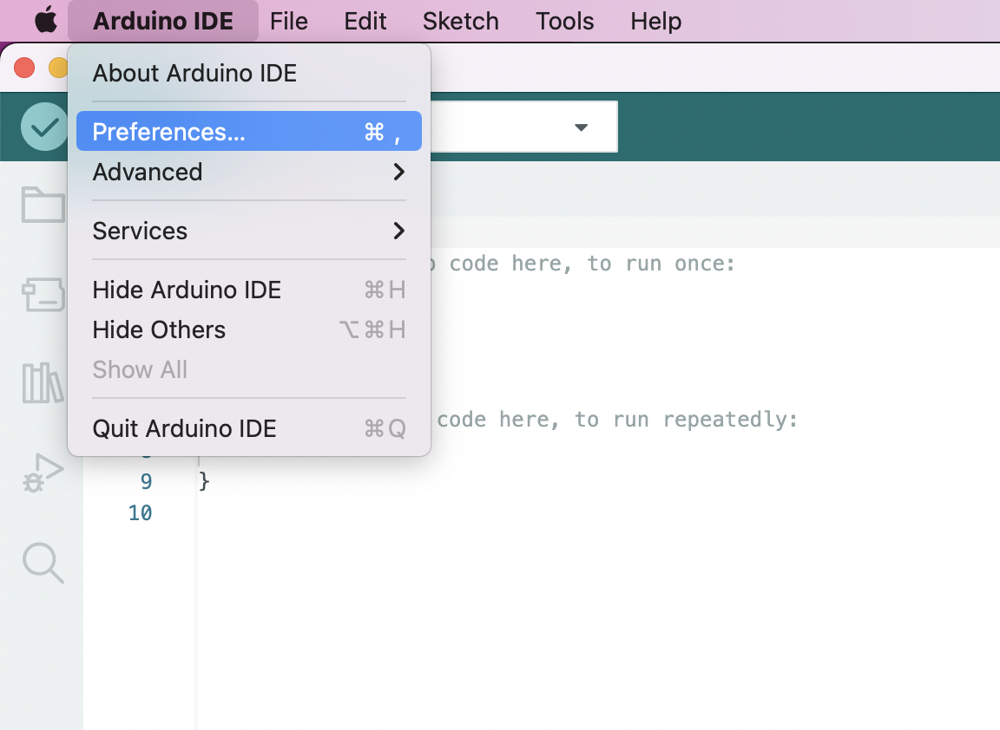

.. _doc_summary_environment_01_arduino_ide:

环境搭建——安装Arduino IDE
==================================================

RBZ V1.0的  **主控MCU** （微型计算机）采用的是  **ESP32**，ESP32是一款具备 **WIFI，蓝牙通信功能的双核单片机**，在市面上许多物联网科技产品的主控芯片都采用这款单片机。

.. image:: assets/mcu.png

ESP32的开发方式有三种：

1. 使用 **Arduino IDE** 开发，沿用Arduino C的开发风格， **对初学者友好，开源库众多** 。
2. 使用 **ESP—IDF** 开发，沿用C的开发风格， **可以发挥ESP32全部应用功能，但教程较少，编程过程复杂** 。
3. 使用 **MicroPython** 开发，沿用Python的开发风格，此方式需要先给板子烧写一个特殊的固件， **需要Python基础** 。

所以我们这样的初学者通常会使用Arduino IDE来编写程序，编译，然后上传到RBZ V1.0中并运行程序。

**这一小节将带领你从零开始搭建Arduino IDE的编译环境！**

Windows电脑用户
~~~~~~~~~~~~~~~~~~~~~~~~

安装Arduino IDE
------------------------
登录Arduino `官网 <https://www.arduino.cc/en/software>`_ （https://www.arduino.cc/en/software）下载最新版本的Arduino IDE。

点击 **DOWNLOAD OPTIONS** 下电脑对应的版本 **（Windows 7以上建议选择红框的选项）**。

.. image:: assets/Arduinodownload.png

点击 **JUST DOWNLOAD** ，开始下载Arduino IDE安装包。

.. image:: assets/Arduinodownload_1.png

下载得到arduino-XX.XX.XX-windows.exe（XX.XX.XX为版本号，教程使用1.8.19版本）安装文件，常规点击“下一步”的安装方式安装即可（ **不需要更改任何设置** ）。

电脑桌面显示Arduino IDE图标，并 **双击** 打开。

.. image:: assets/Arduinoidelogo.png

出现如下图所示编写程序界面，即 **安装成功** 。

.. image:: assets/Arduinoide.png

将Arduino IDE设置为 **中文**。

首先是找到菜单里的： **File->Preferences** （或者使用快捷键 Ctrl+逗号）。

.. image:: assets/ArduinoIDE_cn1.png

将Language改成 **中文（简体）** 。

.. image:: assets/ArduinoIDE_cn2.png

安装ESP32开发包
------------------------
因为Arduino IDE默认是给Arduino开发板用的编译器，默认只有Arduino开发板的相关开发资源。 **如果要想在在Arduino IDE中使用ESP32，需要额外安装ESP32的开发包。** 

**在安装过程中需要连网络** 用来下载ESP32开发板的安装包。

在Arduino IDE软件中下载并安装ESP32开发包，首先是找到菜单里的： **文件->首选项** （或者使用快捷键 Ctrl+逗号）

.. image:: assets/Arduinoideesp32-1.png

在 **附加开发板管理器网址** 中填入以下url：https://raw.githubusercontent.com/espressif/arduino-esp32/gh-pages/package_esp32_index.json

.. image:: assets/Arduinoideesp32-2.png

.. note::
 如果因为经常因网络原因安装失败，可以将上文的url改为：https://dl.espressif.com/dl/package_esp32_index.json

然后打开： **工具->开发板->开发板管理器**，点击 **开发板管理器**（或者使用快捷键 Ctrl+Shift+B）。

.. image:: assets/Arduinoideesp32-3.png

**输入esp32，查看搜索结果，点击安装。**

.. image:: assets/Arduinoideesp32-4.png

安装完成， **重启Arduino IDE。**
打开 **工具->开发板**，列表里显示有ESP32 Arduino，则安装成功。并选择开发板为 **ESP32 Dev Module**。

.. image:: assets/Arduinoideesp32-5.png

简单测试程序
------------------------
编译下载一个简单的串口和电灯程序，测试一下 **RBZ v1.0** 的基本功能。

Arduino编写程序对于初学者来说是非常容易的，它的基础框架就是一个初始函数（ **setup** ）和一个主循环函数（ **loop** ）。

在 **setup函数** 里我们通常编写一些初始化的函数，例如：串口初始化，端口定义等等。

在 **loop函数** 里我们通常编写整个单片机程序，其作用类似于单片机开发中的main函数里的while(1){}，一直循环运行在loop函数中的程序。

第一步：在Arduino IDE导入程序
^^^^^^^^^^^^^^^^^^^^^^^^^^^^^^
将 **测试代码** 导入IDE中。

.. image:: assets/Arduinoidetest1.png

测试代码
^^^^^^^^^^^^^^^^^^^^^^^^^^
.. code-block:: arduino
   :linenos:
   
    #define IO_LED_PIN 2 // 定义IO LED的GPIO编号

    void setup() {
        // 初始化函数
        // 这里的代码将在一开始被执行一次
        pinMode(IO_LED_PIN, OUTPUT); // 设置引脚模式
        Serial.begin(9600);//串口初始化，速率设置为9600
        Serial.println("RBZ v1.0 first test");//串口打印
    }

    void loop() {
        // 主循环函数
        // 这里的代码将在setup()后被一直循环调用
        digitalWrite(IO_LED_PIN, HIGH); // 点亮IO LED，HIGH表示高电平
        Serial.println("RBZ v1.0：LED ON");//串口打印
        delay(500);                     // 等待（延迟）500ms（即0.5s）
        digitalWrite(IO_LED_PIN, LOW);  // 关闭IO LED，LOW表示低电平
        Serial.println("RBZ v1.0：LED OFF");//串口打印
        delay(500);                     // 再等半秒，才进入下一次loop()函数的循环点亮IO LED
    }

第二步：选择BRZ V1.0开发板
^^^^^^^^^^^^^^^^^^^^^^^^^^^^^^
打开 **工具->开发板->ESP32 Arduino**，选择开发板为 **ESP32 Dev Module**。

.. image:: assets/Arduinoideesp32-5.png

第三步：编译程序
^^^^^^^^^^^^^^^^^^^^^^^^^^^^^^
点击IDE中 **编译按键**。 **（首次编译，需要几分钟，请耐心等待）**

在弹出的窗口中选择保存位置、和文件名称。

.. image:: assets/Arduinoidetest3.png

保存完成后，IDE开始编译。显示如下图所示，则 **编译成功**。

第四步：烧录程序
^^^^^^^^^^^^^^^^^^^^^^^^^^^^^^

首先使用type-c的 **数据线** 连接电脑。 **（不能使用充电线）**

在电脑桌面， **右键此电脑**，选择 **管理**。

.. image:: assets/Arduinoidetest5.png

选择 **设备管理器** ，后选择 **端口**，查看USB—SERIAL CH340的 **端口号** （每台电脑端口号可能不同）。

.. image:: assets/Arduinoidetest6.png

.. note::
    **如果在端口中，没有显示USB—SERIAL CH340**，请打开 **设备管理器** 中的 **通用串行总线控制器** 里查看是否有 **未知USB设备**。

    .. image:: assets/Arduinoidetestnote1.png

    如果 **有** 请，按照 @Todo 章节来安装驱动。

    如果 **没有** 请，更换type-c数据线，如果还是没有显示请  @Todo 联系我们。

在IDE里面，打开 **工具->端口**，选择开发板的 **端口号**。

点击 **上传**，显示上传成功，则程序烧录成功。

测试效果
^^^^^^^^^^^^^^^^
在IDE里， **打开串口监视器**。将波特率改为9600，RBZ V1.0通过串口向电脑发送板载LED灯的状态。

MAC电脑用户
~~~~~~~~~~~~~~~~~~~~~~~~
安装Arduino IDE
------------------------
登录Arduino `官网 <https://www.arduino.cc/en/software>`_ （https://www.arduino.cc/en/software）下载最新版本的Arduino IDE。

点击 **DOWNLOAD OPTIONS** 下电脑对应的版本 **（Mac OS X10.10 以上建议选择红框中的选项）**。
sss

点击 **JUST DOWNLOAD** ，开始下载Arduino IDE安装包。

    
下载得到arduino-ide_2.0.0_macOS_64bit.dmg，双击打开，按照正常的Mac应用程序安装方式将Arduino IDE拖拽至应用程序文件夹

打开启动台或在访达中打开应用程序文件夹， **双击** Arduino IDE图标打开。

出现如下图所示编写程序界面，则 **安装成功** 。

    
安装ESP32开发包
------------------------

因为Arduino IDE默认是给Arduino开发板用的编译器，默认只有Arduino开发板的相关开发资源。 **如果要想在在Arduino IDE中使用ESP32，需要额外安装ESP32的开发包。** 

**在安装过程中需要连网络** 用来下载ESP32开发板的安装包。

在Arduino IDE软件中下载并安装ESP32开发包，单击Mac菜单栏中Arduino IDE找到preferences或快捷键command+， 打开首选项

将以下url输入其他开发版管理器地址 https://raw.githubusercontent.com/espressif/arduino-esp32/gh-pages/package_esp32_index.json

.. note::
 如果因为经常因网络原因安装失败，可以将上文的url改为：https://dl.espressif.com/dl/package_esp32_index.json

打开： **工具->开发板->开发板管理器**，点击 **开发板管理器**

**输入esp32，查看搜索结果，点击安装。**

安装完成， **重启Arduino IDE。**
打开 **工具->开发板**，列表里显示有ESP32 Arduino，则安装成功。并选择开发板为 **ESP32 Dev Module**。

.. note::
 测试程序部分与Windows几乎相同，请参考前文Windows部分，但要注意Mac系统信息的打开方式。

