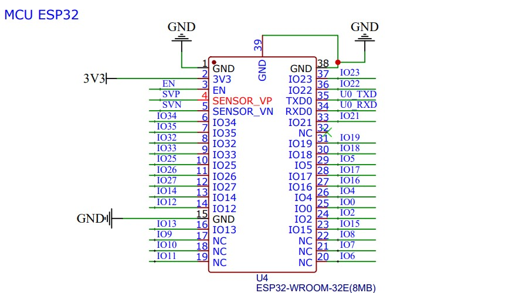
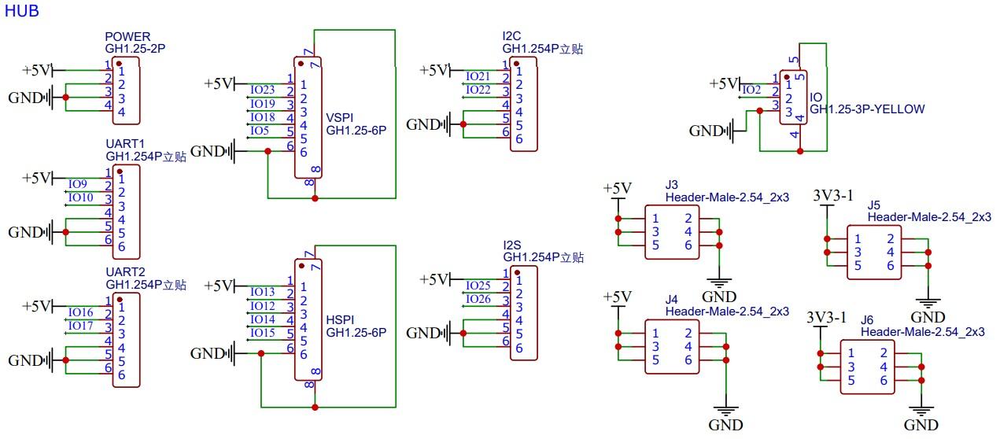
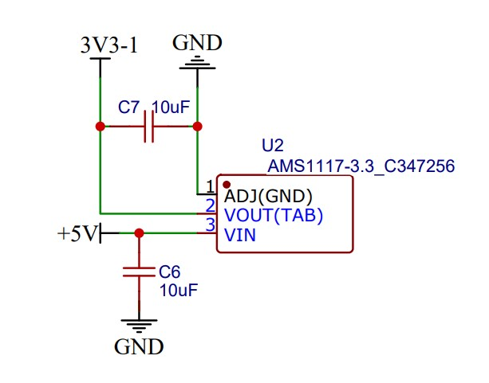
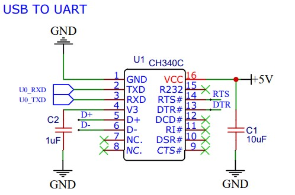

硬件
===========
这里应当写入 **硬件** 的内容

必要的话，还有目录

- 硬件的通俗介绍
- 硬件的全部资料

MCU
---------------
RBZ V1.0采用**ESP32-WROOM-32E**作为MCU。该模组具备**WI-FI、蓝牙通信功能**，内置ESP32-DOWN-V3芯片、ESP32-D0WDR2-V3芯片、Xtensa⑧双核32位LX6微处理器，支持高达240 MHz的时钟频率，拥有448KB ROM、520KB SRAM、16 KB RTC SRAM，采用PCB板载天线，配置了4MB SPI flash。

- WI-FI支持A-MPDU和A-MSDU聚合、支持0.4 μS保护间隔，工作信道中心频率范围: 2412 ~ 2484 MHz
- 蓝牙支持v4.2完整标准（包含传统蓝牙BR/EDR和低功耗蓝牙BLE），支持标准Class-1、Class-2 和Class-3，支持自适应跳频AFH、CVSD和SBC音频编解码算法。
- 模组接口: SD卡、UART、SPI、SDIO、I2C、LEDPWM、电机PWM、I2S.、IR、脉冲计数器、GPIO、电容式触摸传感器、ADC、DAC，
- 40MHz晶振
- 板载PCB天线
- 8MB SPI flash
- 工作电压/供电电压: 3.0~3.6 V 

HUB
---------------
HUB为多端口转发器，支持I2C、I2S通讯协议。

POWER
---------------
RBZ V1.0采用AMS1117-3.3作为降压稳压模块给芯片供电。AMS1117是一个正向低压降稳压器，在1A电流下压降为1.2V，即：将5V供电电压稳定在3.3V。

USB TO UART
---------------
RBZ V1.0采用CH340C转接芯片实现USB转串口。在串口方式下，CH340 提供常用的 MODEM 联络信号，用于为计算机扩展异步串口，或者将普通的
串口设备直接升级到USB总线。
- 全速USB设备接口，兼容USB V2.0。
- 硬件全双工串口，内置收发缓冲区，支持通讯波特率50bps～2Mbps。
- 支持常用的MODEM联络信号RTS、DTR、DCD、RI、DSR、CTS。
- 支持5V电源电压和3.3V电源电压。
- 内置时钟，无需外部晶振。
- 提供SOP-16、SOP-8和SSOP-20以及ESSOP-10、MSOP-10无铅封装，兼容RoHS。

    
POWER LED
---------------
POWER LED为上电指示灯。当单片机上电时，LED灯亮。
.. image:: assets/POWER LED.jpg

AUTO PROGRAM
---------------
.. image:: assets/AUTO PROGRAM.jpg

USB
---------------
RBZ V1.0采用TYPE-C-2.0-16PIN--SMT-3作为USB连接器。
.. image:: assets/AUTO PROGRAM.jpg

LED
---------------

POWER
---------------

KEY
---------------

IO
---------------

UART LED
---------------

电机？？？
---------------
