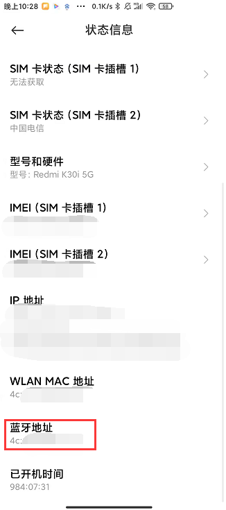

.. _doc_tutorial_advance_01_basic_bluetooth_with_app:

与手机app蓝牙通信（主从两种模式）
==========================================================

我们将会使用单片机内置的蓝牙模块，
以及手机的蓝牙调试助手，
以主、从两种模式来示范单片机蓝牙模块的使用。

.. attention::
    本小节不使用蓝牙模块的搜索功能，
    而是直接找到手机的蓝牙硬件地址，
    写入单片机中。

前言
~~~~~~~~~~~~

我们可以用到不同的蓝牙库（他人写好的驱动）来使用蓝牙模块。

比较常见的有：

1. BluetoothSerial——经典蓝牙
2. BLE——低功耗蓝牙

经典蓝牙模块泛指支持蓝牙协议在4.0以下的模块，
一般用于数据量比较大的传输。

低功耗蓝牙模块指支持蓝牙协议4.0或更高的模块，
也称为BLE模块（Bluetooth Low Energy Module），
最大的特点是功耗的降低。

经典蓝牙的实现（指需要我们编写的代码）较为简单，
在这一小节，
我们将使用BluetoothSerial蓝牙库。

开发过程
~~~~~~~~~~~~

.. highlight:: arduino

创建程序
------------------

打开Arduino IDE，
保存并命名为01_bluetooth。

引入BluetoothSerial蓝牙库
----------------------------------------------

在程序头部添加include：

::
    
    #include "BluetoothSerial.h"

新建BluetoothSerial对象
----------------------------------------------

定义全局变量SerialBT：

::

    BluetoothSerial SerialBT;

主从机模式
---------------------------------------------

我们打开手机蓝牙，
进入蓝牙设置页面，
选择耳机的蓝牙并连接。

这是我们平常使用蓝牙的一种场景。

在这种场景下，
我们的手机蓝牙便是蓝牙连接的发起者（发起连接请求）、扫描者（搜索附近蓝牙），
我们便称：
此时，
手机蓝牙是 **主机**，
而耳机的蓝牙是 **从机**。

.. note:: 
    简单来说，
    哪方蓝牙发起连接请求，
    那它就是主机。

而为了演示单片机蓝牙模块的使用，
我们想要在程序中包含主从两种模式，
所以我们定义一个全局常量IS_MASTER来表示主从模式。

::

    #define IS_MASTER 1 //主从机模式选择 1主机 0从机

这个常量在之后会用到。

.. note::
    如果你手头有两块单片机，
    完全可以举一反三，
    将主机与从机的代码分别上传到两块单片机上，
    让它们互相通信。

蓝牙硬件地址
-------------------------

同Wifi模块类似，
蓝牙模块也有属于自己的硬件地址，
正常来说，
每颗蓝牙模块的 **mac地址（硬件地址）** 是唯一且公共的，
也就是说，
mac地址可以用来唯一标识你手上的单片机的蓝牙模块。

.. note:: 
    也就是类似身份证号码，
    唯一且公共。

我们想要将单片机和手机通过蓝牙相连，
那么当单片机作为主机模式时，
它需要知道手机的蓝牙硬件地址，
才能发起连接请求。

所以，
我们先来获取一下手机的蓝牙硬件地址。

在手机中找到类似如下的界面：

.. note::
    一般可能会在“关于手机”的“状态信息”里。

图中圈出的16进制数串就是手机的蓝牙硬件地址（类似xx-xx-xx-xx-xx-xx的结构）。

然后，
我们在单片机程序中添加一个全局变量（当然你也可以定义成常量）mac_address，
来保存手机的蓝牙硬件地址。

::

    // 从机（手机）mac地址，替换成自己的手机蓝牙硬件地址
    uint8_t mac_address[6] = { 0xDC, 0x8B, 0x28, 0x47, 0xA2, 0xB0 }; 

.. important::
    记得一定要替换成自己手机或其他设备的蓝牙硬件地址。

.. note:: 
    uint8_t表示无符号8位整型数据，
    一般来说，
    你也可以替换写成unsigned char（无符号字符）。

    0x开头的数据表示16进制计数，
    如：0xDC（16进制） = 220（10进制）。

    mac地址DC-8B-28-47-A2-B0中，
    包含12个16进制数，
    每2个16进制数组成一个无符号字符（无符号字符表示8位数据，容量为2\ :sup:`8`\=256，2个16进制数字组合在一起的数据量也是16*16=256），
    那么，
    mac地址实际上就是6个无符号字符。

    所以，
    我们这里定义一个包含6个元素的uint8_t数组来保存mac地址。

蓝牙事件回调函数
------------------------------

回调函数（callback），
在软件、程序开发中经常看到，
简单来说，
当系统触发了某些事件时，
程序会自主调用callback，
而程序员需要在callback中处理事件和数据。

当蓝牙模块发生以下事件时（不一定全面），
将会触发蓝牙事件回调函数：

1. 连接成功。
2. 断开连接。
3. 接收到数据。
4. 发送完成。

我们在程序的 **setup函数之上**，
再定义一个bluetooth_event_callback函数，
来作为蓝牙事件回调函数。

.. hint::
    你也可以将蓝牙事件回调函数定义在其他地方，
    但要注意把函数的声明放在函数的调用之前。

我们将通过if分支处理上述事件，
但里面的具体代码不急着编写，
之后 **写完初始化函数之后再添加**。

::

    /**
    * event: 事件类型
    * *param: 参数指针
    */
    void bluetooth_event_callback(esp_spp_cb_event_t event, esp_spp_cb_param_t *param)  //蓝牙事件回调函数
    {
        if(event == ESP_SPP_OPEN_EVT || event == ESP_SPP_SRV_OPEN_EVT)  //蓝牙连接成功标志 
        {                                                               //蓝牙主机和从机模式对应的标志不同，前者是主机模式的，后者是从机模式
        }
        else if(event == ESP_SPP_CLOSE_EVT)                             //蓝牙断开连接标志
        {
        }
        else if(event == ESP_SPP_DATA_IND_EVT)                          //数据接收标志
        {
        }
        else if(event == ESP_SPP_WRITE_EVT)                             //数据发送标志
        {
        }
    }

初始化
------------------------------

在setup初始化函数中，
我们便会判断先前定义的IS_MASTER常量，
进入主机、从机两个分支之一，
进行不同的初始化方式。

SerialBT是在BluetoothSerial中包含的，
我们就像是操作Serial串口一样操作SerialBT，
来使用蓝牙模块。

::

    void setup() {
        Serial.begin(9600);
        Serial.println("setup");
        SerialBT.register_callback(bluetooth_event_callback);   // 注册蓝牙事件回调函数
        
        if (IS_MASTER)
        {
            SerialBT.begin("BLUETOOTH_MASTER", true);           //开启蓝牙 名称为:"BLUETOOTH_MASTER" 主机模式
            Serial.println("init bluetooth as master");
            SerialBT.connect(mac_address);                      // 使用从机mac地址，发起连接
        }
        else
        {
            SerialBT.begin("BLUETOOTH_SLAVE");                  // 开启蓝牙 名称为:"BLUETOOTH_SLAVE" 从机模式
            Serial.println("init bluetooth as slave");
        }
    }

补全蓝牙事件回调函数
------------------------------

经过初始化，
我们知道了SerialBT这个蓝牙操作接口。

当蓝牙成功连接、断开连接、发送完毕时，
我们通过Serial串口输出提示信息。

当蓝牙接收到数据的时候，
我们需要从SerialBT中读取数据，
转发到Serial串口。

.. hint::
    在实际的蓝牙应用中，
    你可能需要保存SerialBT中读取到的数据，
    来做其他使用。

补全蓝牙事件回调函数如下：

::

    void bluetooth_event_callback(esp_spp_cb_event_t event, esp_spp_cb_param_t *param)  //蓝牙事件回调函数
    {
        if (event == ESP_SPP_OPEN_EVT || event == ESP_SPP_SRV_OPEN_EVT) //蓝牙连接成功标志
        {                                                               //蓝牙主机和从机模式对应的标志不同，前者是主机模式的，后者是从机模式
            Serial.println("===connect ok===");
        }
        else if (event == ESP_SPP_CLOSE_EVT)    //蓝牙断开连接标志
        {
            Serial.println("===disconnect ok===");
        }
        else if (event == ESP_SPP_DATA_IND_EVT) //数据接收标志
        {
            while (SerialBT.available())
            {
                Serial.write(SerialBT.read());
            }
            Serial.println("===receive ok===");
        }
        else if (event == ESP_SPP_WRITE_EVT)    //数据发送标志
        {
            Serial.println("===send ok===");
        }
    }

.. note::
    SerialBT.available()同Serial.available()一样，
    就是查询SerialBT是否有待读取的传来数据。

    SerialBT.read()同Serial.read()一样，
    从待读取的传来数据中读取一个字节。

    我们将SerialBT.read()读到的字节，
    当SerialBT.available()时，
    循环写入Serial，
    便将蓝牙接收的数据转发到了串口。

主循环
------------------------------

在loop函数中，
当单片机作为蓝牙主机时，
每隔一定时间就发出数据到从机。

::

    void loop()
    {
        static char send_str[] = "Hello Slave!\r\n";
        if (IS_MASTER) SerialBT.write((uint8_t*)send_str, strlen(send_str));
        delay(500);
    }

.. note::
    send_str是一个静态字符数组。

    关于BluetoothSerial的write函数有两个重写：

    - size_t write(uint8_t c); // 发送单个字符
    - size_t write(const uint8_t *buffer, size_t size); // 发送字符串

    (uint8_t*)send_str是将send_str从char*强制转为发送字符串所需要的uint8_t*。

整体程序
~~~~~~~~~~~~~~~~~~~~

.. code-block:: arduino
    :linenos:

    #include "BluetoothSerial.h"
    #define IS_MASTER 1 //主从机模式选择 1主机 0从机

    BluetoothSerial SerialBT;

    // 从机（电脑）mac地址，替换成自己的电脑蓝牙硬件地址
    uint8_t mac_address[6] = { 0x4C, 0x63, 0x71, 0x21, 0xB5, 0x8F };

    /**
    event: 事件类型
    * *param: 参数指针
    */
    void bluetooth_event_callback(esp_spp_cb_event_t event, esp_spp_cb_param_t *param)  //蓝牙事件回调函数
    {
        // 蓝牙连接成功标志
        // 蓝牙主机和从机模式对应的标志不同，前者是主机模式的，后者是从机模式
        if (event == ESP_SPP_OPEN_EVT || event == ESP_SPP_SRV_OPEN_EVT) 
        {                                                               
            Serial.write("===connect ok===\r\n");
        }
        else if (event == ESP_SPP_CLOSE_EVT)    // 蓝牙断开连接标志
        {
            Serial.write("===disconnect ok===\r\n");
        }
        else if (event == ESP_SPP_DATA_IND_EVT) // 数据接收标志
        {
            while (SerialBT.available())
            {
                Serial.write(SerialBT.read());
            }
            Serial.write("===receive ok===\r\n");
        }
        else if (event == ESP_SPP_WRITE_EVT)    // 数据发送标志
        {
            Serial.write("===send ok===\r\n");
        }
    }

    void setup() {
        Serial.begin(9600);
        Serial.println("setup");
        SerialBT.register_callback(bluetooth_event_callback); // 注册蓝牙事件回调函数

        if (IS_MASTER)
        {
            SerialBT.begin("BLUETOOTH_MASTER", true); // 开启蓝牙 名称为:"BLUETOOTH_MASTER" 主机模式
            Serial.println("init bluetooth as master");
            SerialBT.connect(mac_address);
            delay(2000);
        }
        else
        {
            SerialBT.begin("BLUETOOTH_SLAVE");       // 开启蓝牙 名称为:"BLUETOOTH_SLAVE" 从机模式
            Serial.println("init bluetooth as slave");
        }
    }

    void loop()
    {
        static char send_str[] = "Hello Slave!\r\n";
        if (IS_MASTER) SerialBT.write((uint8_t*)send_str, strlen(send_str));
        delay(500);
    }

APP
~~~~~~~~~~~~~~~~~~~~

从应用商店等渠道下载一个蓝牙调试助手，
或者使用此软件。

链接：https://pan.baidu.com/s/1k6rofFnew-5EnTZq-YXUYg 

提取码：hwxa 

.. hint::
    你也可以找到可用的电脑端等其他平台的蓝牙调试助手来测试。

    当然，
    你也可以用第二块单片机与第一块相连，
    要注意二者一个是主机一个是从机，
    主机需要知道从机的蓝牙模块硬件地址。

部署测试
~~~~~~~~~~~~~~~~~~~~

单片机蓝牙作为从机
-------------------------------------

调整IS_MASTER为0，
上传代码到单片机。

@Todo

单片机蓝牙作为主机
-------------------------------------

调整IS_MASTER为1，
上传代码到单片机。

@Todo
