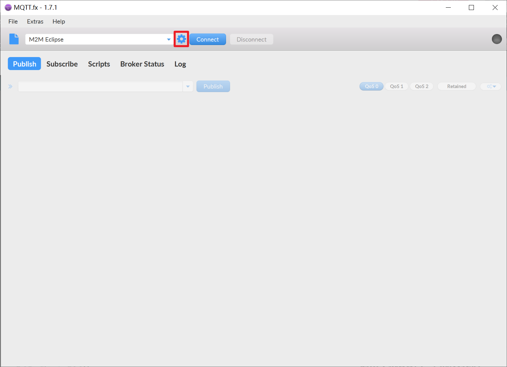

.. _doc_tutorial_advance_05_MQTT_1_basic:
WIFI--MQTT基本原理
==================

我们将会使用MQTT.fx软件完成MQTT服务端与客户端的通信，以理解MQTT的基本构成与通讯方式

前言
----

MQTT是什么
~~~~~~~~~~

MQTT（Message Queuing Telemetry
Transport，消息队列遥测传输协议），是一种\ **基于发布/订阅**\ （publish/subscribe）模式的"轻量级"通讯协议，该协议构建于TCP/IP协议上，由IBM在1999年发布。MQTT最大优点在于，可以以极少的代码和有限的带宽，为连接远程设备提供实时可靠的消息服务。作为一种低开销、低带宽占用的即时通讯协议，使其在物联网、小型设备、移动应用等方面有较广泛的应用。

MQTT的优势
~~~~~~~~~~

**简单**\ ：使用发布/订阅消息模式，提供一对多的消息发布，解除了应用程序耦合。

**稳定**\ ：MQTT工作在TCP/IP协议上，TCP/IP协议可以提供稳定的网络连接。

**轻量**\ ：小型传输，固定长度的头部仅2字节，协议交换最小化，以降低网络流量。非常适合能量敏感，流量敏感的低带宽物联网应用。

**开源**\ ：源代码开放，百度云、阿里云、中国移动onenet等几乎所有的开放性物联网平台都支持MQTT。

MQTT的原理
~~~~~~~~~~

MQTT协议中有三种角色，为发布者(Publishe)、订阅者(Subscribe)、代理（服务器）(Broker)。其中发布者和订阅者都是客户端，代理是服务器端，客户端可以同时是发布者与订阅者。

MQTT通讯测试
------------

.. _安装mqttfx171:

安装MQTTfx1.7.1
~~~~~~~~~~~~~~~

新版的mqttfx需要付费使用，我们使用老版本的1.7.1

| MQTTfx网盘链接 （太极创客网盘源）
| Windows版(64位) https://pan.baidu.com/s/13v0ROf1dOzu2tXqmw3iBMg
  提取码:r9f7

安装过程一路确认即可

MQTT服务器设置
~~~~~~~~~~~~~~

点击小齿轮以编辑配置文件

点击左下角的加号，新建配置文件，然后修改你自己的各项参数

-  Profile Name（配置名称）随意起一个左侧栏未出现的新名称即可

-  Profile Type（配置种类）我们需要的是一个MQTT代理，默认即可

-  Broker
   Address（代理地址）MQTT服务器地址，这里使用\ `然也物联 <http://www.ranye-iot.net>`__\ 的公用MQTT服务器：\ *test.ranye-iot.net*

-  Broker Port（代理端口）服务器的端口，然也物联的TCP端口为1883

-  Client
   ID（客户端ID）MQTT客户端的ID名，因为使用公共服务器，所以建议点击右侧\ ``Generate``\ 来生成一个独一无二的ID以保证不会撞车

下半区域其他设置默认即可，修改完成点击\ ``APPLY``\ 以保存并应用配置

MQTT的发布与订阅
~~~~~~~~~~~~~~~~

回到软件主界面，点击\ ``Connect``\ 按钮，这时应该可以看到右上角是绿色，代表连接正常，此时的Publish（发布），Subscribe（订阅）等设置为可更改状态

点击Subscribe进入订阅页面，在输入框内给你的主题(topic)起一个名字，然后点击右侧Subscribe按钮

.. image:: assets/5-6.png

可以看到已经成功监听了一个主题

点击Publish进入发布页面，在输入框内粘贴你刚才在订阅界面新建的主题名，在下方白框内输入一些信息，然后点击右侧Publish按钮

此时回到Subscribe页面，如果一切顺利，你应该可以看到你刚才发送的内容了

