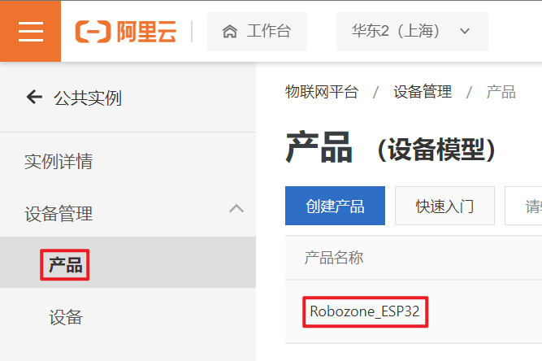
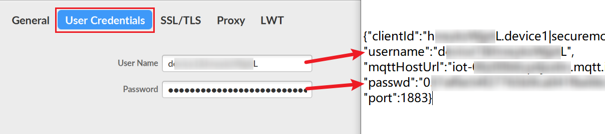
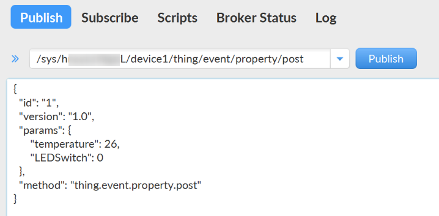

.. _doc_tutorial_advance_06_MQTT_2_aliyun:
WIFI--MQTT阿里云
================

我们将在上节课的基础上，将然也物联服务器替换成阿里云IOT服务器，并使用mqtt.fx软件作为客户端进行发布，订阅等操作

.. _服务器端配置阿里云物联网平台）:

服务器端配置（阿里云物联网平台）
--------------------------------

登录阿里云物联网平台控制台
~~~~~~~~~~~~~~~~~~~~~~~~~~

进入 `阿里云IOT官网 <https://iot.aliyun.com/>`__
，在产品栏中找到物联网平台

*主页ui经常改版，找不到也可以直接点击*
`阿里云物联网平台 <https://www.aliyun.com/product/iot/iot_instc_public_cn>`__

找到公共实例并点击试用，免费的那个准没错

这个时候会跳出登陆页面，在注册/登录阿里云账号后，开通服务

.. image:: assets/6-4.png

这个时候应该可以看到\ `物联网平台控制台 <https://iot.console.aliyun.com/lk/summary/new>`__\ 了

在\ **实例概览**\ 页面，点击\ **公共实例**

   免费的公共实例在一段时间未使用后会被冻结，重新激活即可

创建产品、设备与物模型
~~~~~~~~~~~~~~~~~~~~~~

-  产品相当于一类设备的集合，同一产品下的设备具有相同的功能。

-  物模型就是将实际产品抽象成由属性、服务、事件所组成的数据模型，它可以便于物联网平台管理和数据交互。

就用共享单车举例，共享自行车和共享电动车属于不同的产品，各共享自行车是不同的设备，物模型则是自行车的车锁开关情况，gps位置等数据组成的数据集合。

创建产品
^^^^^^^^

在左侧导航栏，选择\ **设备管理 > 产品** ，点击 **创建产品**

在\ **新建产品**\ 页面，配置参数后，单击\ **确认**

本文示例的\ **产品名称**\ 为\ **Robozone_ESP32**\ ，\ **所属品类**\ 为\ **自定义品类**\ ，其他参数使用默认值，如下图所示

创建设备
^^^^^^^^

在左侧导航栏，选择\ **设备管理 > 设备** ，点击 **添加设备**

在\ **添加设备**\ 页面，配置参数后，单击\ **确认**

本文示例的\ **产品**\ 为\ **Robozone_ESP32**\ （即上文创建的产品），\ **DeviceName**\ 为\ **device1**\ ，\ **备注名称**\ 为\ **设备1**\ ，如下图所示

定义物模型
^^^^^^^^^^

在左侧导航栏，选择\ **设备管理 > 产品**
。在产品列表中，找到已创建的产品，单击操作栏的\ **查看**\ 。

在产品详情页，单击\ **功能定义**\ 页签，然后单击\ **编辑草稿**\ 。

在\ **功能定义**\ 页面的\ **默认模块**\ ，单击\ **添加自定义功能**\ ，进行物模型配置，然后单击\ **确认**\ 。

按照如下图设置产品的\ **LED开关**\ 和\ **温度**\ 属性。

单击\ **功能定义**\ 的\ **编辑草稿**\ 页面左下方的\ **发布上线**\ 。控制台页面会弹出\ **发布物模型上线**\ 对话框。

如果存在已上线的版本，可以在\ **比对结果**\ 对话框中查看修改点。确认无误后，单击\ **确认查阅**\ ，回到\ **发布物模型上线**\ 对话框。

如果是第一次发布，直接选中“确认已查看当前版本与线上版本的比对结果”前的复选框。

单击\ **确定**\ ，完成物模型的发布。

获取设备证书和MQTT连接参数
~~~~~~~~~~~~~~~~~~~~~~~~~~

-  **设备证书**\ 包含ProductKey、DeviceName和DeviceSecret，是设备与物联网平台进行通信的重要身份认证。

-  **MQTT连接参数**\ 是设备通过MQTT接入工具连接物联网平台时，需输入的签名认证参数，有username、passwd和mqttClientId。

在左侧导航栏\ **设备管理 > 设备**
，找到上文添加的设备，点击\ **查看**\ 。

获取设备证书
^^^^^^^^^^^^

在设备详情页面，找到DeviceSecret，点击\ **查看**

点击\ **一键复制**\ ，然后将内容保存至新建的《物联网设备信息》txt文件

获取MQTT连接参数
^^^^^^^^^^^^^^^^

在设备信息页面，找到MQTT连接参数，点击\ **查看**

点击\ **一键复制**\ ，然后将内容保存至《物联网设备信息》

.. _客户端配置mqttfx）:

客户端配置（MQTT.fx）
---------------------

编辑配置文件
~~~~~~~~~~~~

打开MQTT.fx软件，点击\ **小齿轮**\ 编辑配置文件并\ **点击左下角加号**\ 新建配置

在\ **Edit Connection Profiles**\ 页面，完成以下参数的设置

+----------------+----------------------------------------------------+
| 参数           | 说明                                               |
+================+====================================================+
| Profile Name   | 自定义名称                                         |
+----------------+----------------------------------------------------+
| Profile Type   | MQTT服务器连接，选择\ **MQTT Broker**              |
+----------------+----------------------------------------------------+
| Broker Address | MQTT接入域名，对应                                 |
|                | 《物联网设备信息》中已获取的\ **mqttHostUrl**\ 值  |
+----------------+----------------------------------------------------+
| Broker Port    | 设置为1883                                         |
+----------------+----------------------------------------------------+
| Client ID      | MQTT的协议字段，                                   |
|                | 输入《物联网设备信息》中已获取的\ **clientId**\ 值 |
+----------------+----------------------------------------------------+

.. image:: assets/6-26.png

单击\ **User Credentials**\ ，设置\ **User Name**\ 和\ **Password**

+-----------+---------------------------------------------------------+
| 参数      | 参数说明                                                |
+===========+=========================================================+
| User Name | 由设备名称DeviceName、and（&）和产品ProductKey组        |
|           | 成，输入《物联网设备信息》中已获取的\ **username**\ 值  |
+-----------+---------------------------------------------------------+
| Password  | 通过选择的加密方法，以设备                              |
|           | 的DeviceSecret为密钥，将参数和参数值拼接后，加密生成Pas |
|           | sword。输入《物联网设备信息》中已获取的\ **passwd**\ 值 |
+-----------+---------------------------------------------------------+

我们使用的是TLS直连模式，单击\ **SSL/TLS**\ ，选中\ **Enable
SSL/TLS**\ ，设置\ **Protocol**\ 为\ **TLSv1.2**

设置完成后，单击右下角的\ **OK**

回到主界面，点击\ **Connect**\ ，右侧亮绿灯，即表示连接成功

也可在控制台，在对应实例下，选择\ **设备管理**>\ **设备**\ ，看到该设备的状态为在线

MQTT客户端-服务器端通信
-----------------------

客户端发布消息
~~~~~~~~~~~~~~

在MQTT.fx上进入\ **Publish**\ 页面，在\ **Publish**\ 左侧文本框中，输入具有\ **发布**\ 权限的Topic：

.. code:: 

   /sys/${productKey}/${deviceName}/thing/event/property/post
   （请将${占位字段}替换为《物联网设备信息》中自己的参数）

在下侧大文本框中，输入具有\ **发布**\ 权限的Topic：

.. code:: json

   {
     "id": "1",
     "version": "1.0",
     "params": {
         "temperature": 26,
         "LEDSwitch": 0
     },
     "method": "thing.event.property.post"
   }

+-------------+--------+---------------------------------------------+
| 参数        | 类型   | 说明                                        |
+=============+========+=============================================+
| **id**      | String | 消息ID号。String类型的数字，取值范围0~42949 |
|             |        | 67295，且每个消息ID在当前设备中具有唯一性。 |
+-------------+--------+---------------------------------------------+
| **version** | String | 协议版本号。目前协议版本号唯一取值为1.0。   |
+-------------+--------+---------------------------------------------+
| **params**  | Object | 请求参数。如以上示例中，设备上报了的        |
|             |        | 两个属性temperature（温度）和LEDSwitch（开  |
|             |        | 关）的信息。具体属性信息，包含属性上报时间  |
|             |        | （time）和上报的属性值（value）。若仅传入属 |
|             |        | 性值，无需上传字段\ **time**\ 和\ **value** |
+-------------+--------+---------------------------------------------+
| **method**  | String | 请求方法                                    |
|             |        | 。例如：\ ``thing.event.property.post``\ 。 |
+-------------+--------+---------------------------------------------+

点击右侧\ **Publish**\ 按钮

再到\ **设备管理>设备>device1>物模型数据**\ 中，开启右侧的\ **实时刷新**\ ，数据成功上传至阿里云平台

客户端订阅消息
~~~~~~~~~~~~~~

在MQTT.fx上进入\ **Subscribe**\ 页面，在\ **Subscribe**\ 左侧文本框中，输入具有\ **订阅**\ 权限的Topic：

.. code:: 

   /sys/${productKey}/${deviceName}/thing/event/property/post_reply
   （请将 ${占位字段}替换为《物联网设备信息》中自己的参数）

点击右侧\ **Subscribe**\ 按钮

这里订阅的Topic是\ **请求的返回数据**\ ，所以去\ **Publish页面**\ 再发布一条消息可以看到反馈

在\ **Subscribe页面**\ 下，查看物联网平台返回给设备的响应消息

如下图所示，设备上报属性成功

