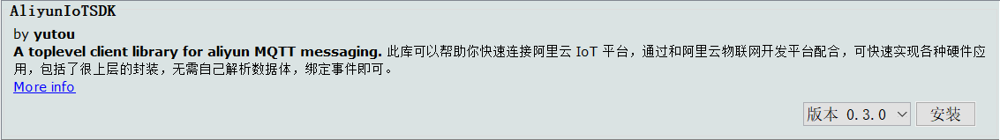
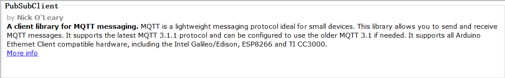
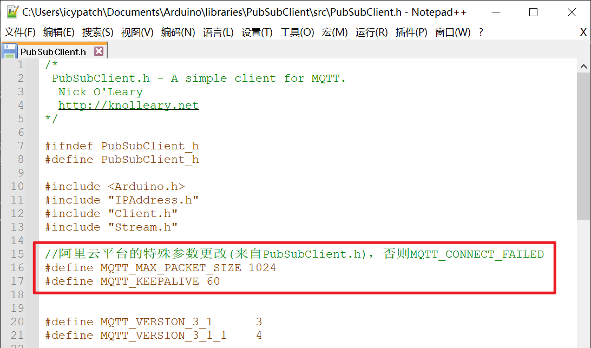
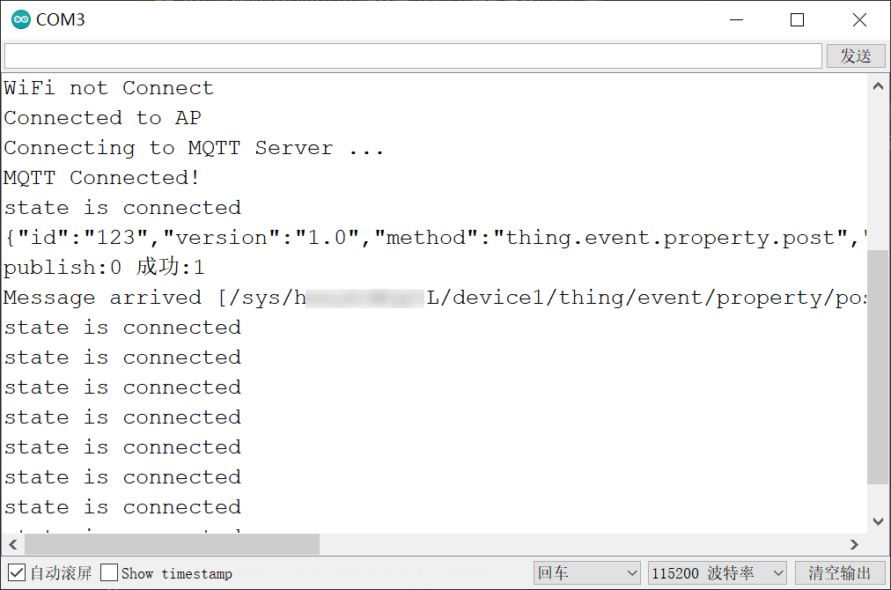
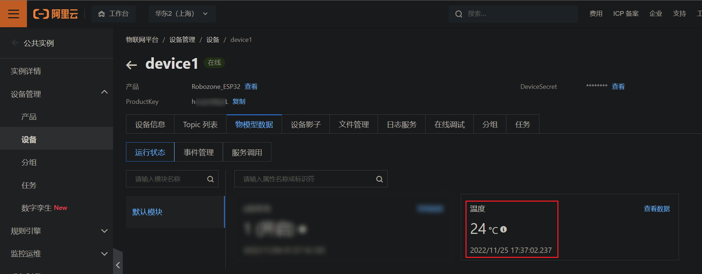
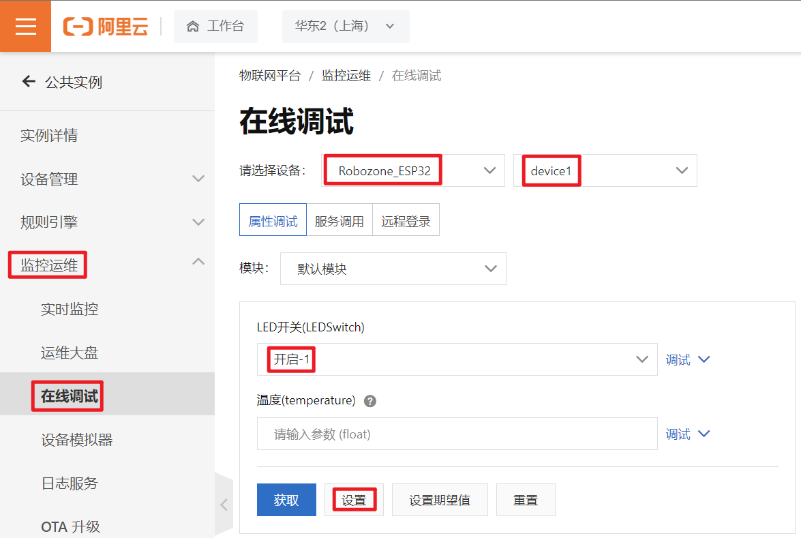

.. _doc_tutorial_advance_07_MQTT_3_esp32:
WIFI--MQTT硬件实操
==================

前言
----

在之前的小节中，我们了解了MQTT的基本原理，订阅发布操作和阿里云IOT的使用方法

在本节中，我们会使用ESP32上报数据至阿里云平台，阿里云平台下发LED开关数据并使开发板亮灯

主要程序
--------

引入物联网库，并设置基础信息
~~~~~~~~~~~~~~~~~~~~~~~~~~~~

.. code:: c++

   //引入WIFI基础库以及阿里云物联网SDK库及其依赖
   #include <WiFi.h> //基础wifi库
   #include <AliyunIoTSDK.h> //阿里云IOT SDK库
   #include <PubSubClient.h> //是MQTT发布/订阅功能的头文件
   #include <SHA256.h>   //密钥加密算法的头文件
   #include <ArduinoJson.h>  //支持Json数据格式的头文件

   // 设置 wifi 信息，根据你的实际情况修改（仅支持2.4ghz）
   #define WIFI_SSID "*******"
   #define WIFI_PASSWD "******"
   // 设置产品和设备的信息，从上一节的《物联网设备信息.txt》中获取
   #define PRODUCT_KEY "h*********L"
   #define DEVICE_NAME "d*****1"
   #define DEVICE_SECRET "8******************************4"
   #define REGION_ID "cn-shanghai"	//此项无需修改

   const int IO_LED_PIN = 2; // 定义IO LED的GPIO编号
   static WiFiClient espClient;  //实例化WiFiClient对象

本次开发用到了多个库，解释一下它们的用处：

<WiFi.h>：提供基础wifi功能

<AliyunIoTSDK.h>（AliyunIoTSDK-0.3.0）：最重要的库，用于快速便捷地与阿里云IOT平台建立通讯

<PubSubClient.h>（PubSubClient-2.8.0）：AliyunIoTSDK的依赖，用于MQTT协议通信

<SHA256.h>（Crypto-0.4.0）：AliyunIoTSDK的依赖，用于密钥加密运算

<ArduinoJson.h>（ArduinoJson-6.19.4）：AliyunIoTSDK的依赖，用于JSON数据解析

在 **arduinoIDE上侧栏 > 工具 > 管理库** 中安装需要使用的库

.. note::

   在引入库后请进行一次验证编译操作（即左上角浅绿色√），如有出现
   **“\ WiFi.h对应多个库\ ”** 的报错提示，请备份并删除
   **“\ 未使用：...”** 路径后libraries下的WiFi文件夹

   .. image:: assets/7-5.png

更改MQTT连接参数
~~~~~~~~~~~~~~~~

因阿里云IOT平台的规则有些许不同，如果不更改则会无法连接平台，我们需要更改\ *<PubSubClient.h>*\ 头文件的设置

在 **arduinoIDE上侧栏 > 文件 > 首选项** 中找到项目文件夹

进入文件夹后，在 **\\Arduino\\libraries\\PubSubClient\\src** 下，打开
**PubSubClient.h** 文件

在最后一个\ **#include**\ 语句下，添加如下内容，然后保存

.. code:: c++

   //阿里云平台的特殊参数更改(来自PubSubClient.h)，否则MQTT_CONNECT_FAILED
   #define MQTT_MAX_PACKET_SIZE 1024
   #define MQTT_KEEPALIVE 60

MQTT事件回调函数
~~~~~~~~~~~~~~~~

回调函数（callback）， 在软件、程序开发中经常看到， 简单来说，
当系统触发了某些事件时， 程序会自主调用callback，
而程序员需要在callback中处理事件和数据。

在setup()中，使用阿里云SDK绑定物模型id与回调函数名称，那么每当阿里云下发数据时，就会触发回调函数，若触发LED回调函数，我们则在回调函数中完成灯的开与关。

.. code:: c++

   // LED属性修改的回调函数
   void LEDCallback(JsonVariant p)
   {
       int LEDSwitch = p["LEDSwitch"];
       if (LEDSwitch == 1)
       {
           digitalWrite(IO_LED_PIN, HIGH); // 点亮IO LED，HIGH表示高电平
       } 
       else
       {
           digitalWrite(IO_LED_PIN, LOW);  // 关闭IO LED，LOW表示低电平
       }
   }

初始化
~~~~~~

为了程序美观，初始化WiFi被封装在一个单独的函数内

设置wifi为终端模式，并根据传入的参数连接wifi，直到连接成功为止

.. code:: c++

   // 初始化 wifi 连接
   void wifiInit(const char *ssid, const char *passphrase)
   {
       WiFi.mode(WIFI_STA);
       WiFi.begin(ssid, passphrase);
       while (WiFi.status() != WL_CONNECTED)
       {
           delay(1000);
           Serial.println("WiFi not Connect");
       }
       Serial.println("Connected to AP");
   }

值得注意的是，运行\ ``AliyunIoTSDK::begin()``\ 会和阿里云连接，但运行\ ``AliyunIoTSDK::send()``\ 仅为设置发送内容，并不会真的发送数据，使其真正运作的函数在后续的loop()内

.. code:: c++

   void setup() {
       //初始化串口和LED引脚
       Serial.begin(115200);
       pinMode(IO_LED_PIN, OUTPUT); // 设置LED引脚为推挽输出
       //初始化wifi
       wifiInit(WIFI_SSID, WIFI_PASSWD);
       //初始化iot需传入wifi的client，和设备产品信息
       AliyunIoTSDK::begin(espClient, PRODUCT_KEY, DEVICE_NAME, DEVICE_SECRET, REGION_ID);
       //绑定一个设备属性回调，当远程修改此属性，会触发LEDCallback
       //LEDSwitch 是在设备产品中定义的物模型id
       AliyunIoTSDK::bindData("LEDSwitch", LEDCallback);
       //发送一个数据到云平台，temperature 是在设备产品中定义的物模型id
       AliyunIoTSDK::send("temperature", 24);
   }

主循环
~~~~~~

主循环很简单，得益于阿里云SDK的帮助，仅仅是一个语句就能让整个MQTT功能开始运作，使其定时检查并保持连接，定时发送数据

.. code:: c++

   void loop() {
     AliyunIoTSDK::loop(); //检查连接和定时发送信息
   }

整体程序
--------

.. code:: c++

   //引入WIFI基础库以及阿里云物联网SDK库及其依赖
   #include <WiFi.h> //基础wifi库
   #include <AliyunIoTSDK.h> //阿里云IOT SDK库
   #include <PubSubClient.h> //是MQTT发布/订阅功能的头文件
   #include <SHA256.h>   //密钥加密算法的头文件
   #include <ArduinoJson.h>  //支持Json数据格式的头文件

   // 设置 wifi 信息，根据你的实际情况修改（仅支持2.4ghz）
   #define WIFI_SSID "*******"
   #define WIFI_PASSWD "******"
   // 设置产品和设备的信息，从上一节的《物联网设备信息.txt》中获取
   #define PRODUCT_KEY "h*********L"
   #define DEVICE_NAME "d*****1"
   #define DEVICE_SECRET "8******************************4"
   #define REGION_ID "cn-shanghai"	//此项无需修改

   const int IO_LED_PIN = 2; // 定义IO LED的GPIO编号
   static WiFiClient espClient;  //实例化WiFiClient对象

   void setup() {
       //初始化串口和LED引脚
       Serial.begin(115200);
       pinMode(IO_LED_PIN, OUTPUT); // 设置LED引脚为推挽输出
       //初始化wifi
       wifiInit(WIFI_SSID, WIFI_PASSWD);
       //初始化iot需传入wifi的client，和设备产品信息
       AliyunIoTSDK::begin(espClient, PRODUCT_KEY, DEVICE_NAME, DEVICE_SECRET, REGION_ID);
       //绑定一个设备属性回调，当远程修改此属性，会触发LEDCallback
       //LEDSwitch 是在设备产品中定义的物模型id
       AliyunIoTSDK::bindData("LEDSwitch", LEDCallback);
       //发送一个数据到云平台，temperature 是在设备产品中定义的物模型id
       AliyunIoTSDK::send("temperature", 24);
   }

   void loop() {
     AliyunIoTSDK::loop(); //检查连接和定时发送信息
   }

   // 初始化 wifi 连接
   void wifiInit(const char *ssid, const char *passphrase)
   {
       WiFi.mode(WIFI_STA);
       WiFi.begin(ssid, passphrase);
       while (WiFi.status() != WL_CONNECTED)
       { 
           delay(1000);
           Serial.println("WiFi not Connect");
       }
       Serial.println("Connected to AP");
   }

   // LED属性修改的回调函数
   void LEDCallback(JsonVariant p)
   {
       int LEDSwitch = p["LEDSwitch"];
       if (LEDSwitch == 1)
       {
           digitalWrite(IO_LED_PIN, HIGH); // 点亮IO LED，HIGH表示高电平
       } 
       else
       {
           digitalWrite(IO_LED_PIN, LOW);  // 关闭IO LED，LOW表示低电平
       }
   }

上传至单片机
------------

打开串口监视器并将程序上传至单片机，应该可以看到如下图所示的串口数据

数据上报至阿里云
----------------

在阿里云进入\ **设备 > device1 > 物模型数据**
就可以看到从esp32上传的数据了

阿里云平台下发数据
------------------

在阿里云侧边栏进入 **监控运维 > 在线调试**
，选择\ **产品**\ 和\ **设备**

将LED开关设置为开启，并点击下侧\ **设置**\ 按钮，就可以看到板子上的白色灯光开启了

