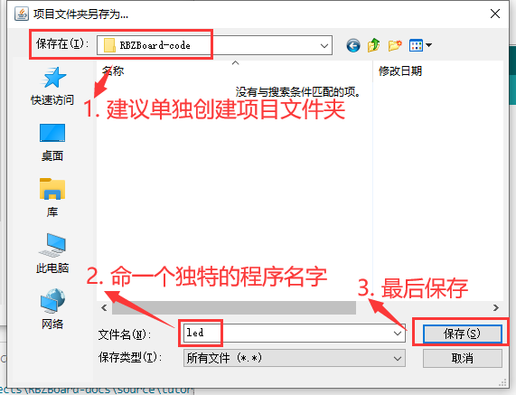

.. _doc_tutorial_basic_01_led:

数字输出——板载LED的闪烁
==================================================

我们将会编写程序，
控制板载的IO LED不断亮、灭，
交替循环。

这一小节将系统性地介绍：

1. 使用Arduino IDE编写代码、编译、上传。
2. 程序的基础流程框架。
3. 管脚的初始化、模式设置、数字输出。
4. 延迟函数的使用。

前言
~~~~~~~~~~~~

LED
----------------

在RBZBoard上可以看到4个已经安装好的
`LED <https://zh.wikipedia.org/wiki/%E7%99%BC%E5%85%89%E4%BA%8C%E6%A5%B5%E7%AE%A1>`_
（发光二极管）。

.. image:: assets/led.png

它们分别是：

- RXD1——串口接收指示灯（暂时不用关注）。
- TXD1——串口发送指示灯（暂时不用关注）。
- **IO——供程序使用**。
- PWR——电源指示灯（连接电源就会常亮）。

当然，我们可以将更多的LED连接到单片机的针脚上。

但 **板载的IO LED是最简单直观的目标**，
在一些场合下，
我们可能会通过观察它的亮灭来判断程序的状态。

I/O
----------------
`I/O <https://zh.wikipedia.org/wiki/I/O>`_
或者IO，
是开发者经常会接触的缩写，
它的全称是Input/Output，
也就是输入输出。

世界上，
任何事物的魅力，
甚至它们区分彼此从而存在的意义，
都在于 **与外界的交互**。

- 绘画——供人欣赏、编辑创作。
- 游戏——获取玩家输入、从画面输出。
- 计算机——读取用户指令、输出结果。

而我们知道，
单片机正是微型计算机，
单片机与外界的交互从根本上都是通过I/O。

而I/O在单片机上就表现为一个个的 **针脚和接口**，
有时我们也称针脚为管脚、引脚。

**我们的板载IO LED便连接着2号GPIO针脚**。

.. note:: 
   GPIO是General Purpose Input/Output的缩写，表示通用输入输出。

   绝大多数情况下，单片机与外界的交互都要直接或间接使用GPIO。

所以，
我们可以在程序中控制这一处针脚，
从而间接控制了板载的IO LED。

Arduino IDE
----------------

Arduino IDE是我们可以使用的比较简单的一种开发环境。

Arduino是另一种单片机，
但与其配套的Arduino IDE可以通过添加库的方式，
来兼容我们的单片机。

之所以称其为“开发环境”，
正是因为它提供了多个环节的功能，
配合起来完成了整个单片机的开发。

- 编辑——提供文件管理、代码编辑功能。
- 编译——将代码编译、链接，形成hex文件。
- 上传（烧录）——将hex文件烧写进单片机。

在这篇教程中不会过多阐述编译和烧录这方面偏向底层的内容。

Arduino IDE的安装、界面介绍可以参考 @Todo。

创建与保存程序
~~~~~~~~~~~~~~~~~~~~~

.. highlight:: arduino

打开Arduino IDE，
不忙着写代码，
我们先保存。

可以按下图操作，也可以使用ctrl+s快捷键。

.. image:: assets/save.png

在弹出的窗口中选择路径、修改命名。

随时保存是个好习惯，
避免程序突然关闭、电脑突然关机等情况导致你的努力白费。

然后我们可以观察初始生成的两个函数：

- setup()
- loop()

它们都没有返回值，
都是被单片机自主调用的，
它们的调用方式如下图注释（双斜杠//引出的内容）所示。

.. code-block:: arduino
   :emphasize-lines: 2-3,7-8
   :linenos:

   void setup() {
      // 初始化函数
      // 这里的代码将在一开始被执行一次
   }

   void loop() {
      // 主循环函数
      // 这里的代码将在setup()后被一直循环调用
   }

编写代码
~~~~~~~~~~~~~~~~~~~~~

我们想要定义一个常量，
来 **表示板载IO LED的GPIO编号**，
方便查看和后续的更改。

所以我们在最外层（setup和loop函数以外）添加代码：

::

   const int IO_LED_PIN = 2; // 定义IO LED的GPIO编号

然后，
我们在setup初始化函数中，
调用pinMode()函数，
来设置IO LED所属的2号GPIO引脚为 **输出模式**。

::

   pinMode(IO_LED_PIN, OUTPUT); // 设置引脚模式

接着，
我们在loop()函数中，
添加代码来 **输出高电平到IO_LED_PIN（GPIO2）**，
从而点亮连接在GPIO2上的IO LED。

::

   digitalWrite(IO_LED_PIN, HIGH); // 点亮IO LED，HIGH表示高电平

光是点亮只会让IO LED保持常亮，
这还不够，
我们希望IO LED在半秒后灭掉。

::

   delay(500); // 等待（延迟）500ms（即0.5s）
   digitalWrite(IO_LED_PIN, LOW); // 关闭IO LED，LOW表示低电平
   delay(500);                    // 再等半秒，才进入下一次loop()函数的循环点亮IO LED

整个程序最后便是：

::

   const int IO_LED_PIN = 2; // 定义IO LED的GPIO编号

   void setup() {
      // 初始化函数
      // 这里的代码将在一开始被执行一次
      pinMode(IO_LED_PIN, OUTPUT); // 设置引脚模式
   }

   void loop() {
      // 主循环函数
      // 这里的代码将在setup()后被一直循环调用
      digitalWrite(IO_LED_PIN, HIGH); // 点亮IO LED，HIGH表示高电平
      delay(500);                     // 等待（延迟）500ms（即0.5s）
      digitalWrite(IO_LED_PIN, LOW);  // 关闭IO LED，LOW表示低电平
      delay(500);                     // 再等半秒，才进入下一次loop()函数的循环点亮IO LED
   }

上传单片机
~~~~~~~~~~~~~~~~~~~~~

我们使用type-c的 **数据线** （不能使用充电线）连接电脑。

然后确认：

- “开发板”选择“ESP32 Dev Module”。
- “端口”选择单片机连接端口。

.. note::
   如果遇到问题，
   可以查看 @Todo 章节来学习如何配置环境并上传程序。

点击上传按钮，
等待上传完毕，
即可看到IO LED在以半秒钟的频率闪烁。

.. image:: assets/result.png
