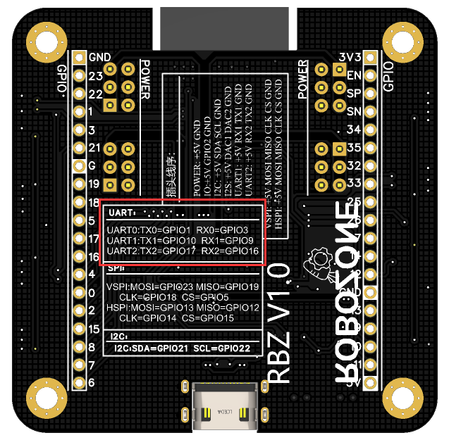
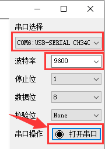
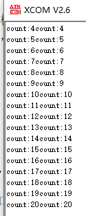
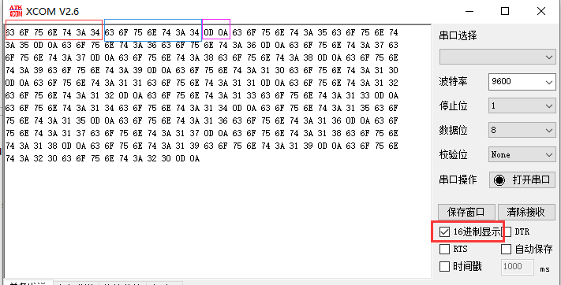
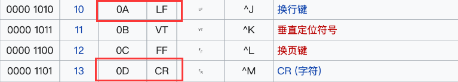
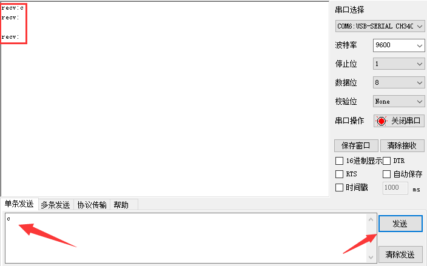
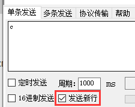
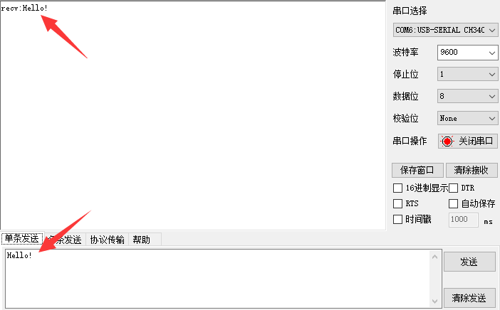
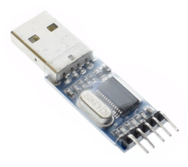

.. _doc_tutorial_basic_02_serial:

串口——信息的输入与输出
==================================================

我们将会编写程序，
并学习使用串口调试助手（应用软件），
进行串口的双向通信。

前言
~~~~~~~~~~~~

串口
-------------

单片机一共有三个串口：

- **UART0**——TX=GPIO1 RX=GPIO3
- **UART1**——TX=GPIO10 RX=GPIO9
- **UART2**——TX=GPIO17 RX=GPIO16

各个串口的对应引脚已在单片机背面标出：

其中，
TX表示发送端，
RX表示接收端，
这也是通用的表示法，
TXD、RXD也是另一种常见表示。

在本篇教程中，
我们会分别使用三个串口进行测试。

.. note:: 
    uart0本身已经通过usb线与电脑连接，
    在上传代码时，
    串口将被占用，
    如果串口调试助手正打开此串口，
    会互相冲突，
    后文将说明使用uart0时的正确操作。

串口调试助手
----------------------

我们使用XCOM V2.6用作串口调试助手，
但实际上这方面的软件多种多样，
你也可以挑选更合适的。

编程
~~~~~~~~~~~~

除了本文列举的一些函数，
还有更多的实用函数，
详情参考 `Serial <https://www.arduino.cc/reference/en/language/functions/communication/serial/>`_

.. highlight:: arduino

初始化串口 设置波特率
----------------------------

首先，
我们要在setup中，
使用合适的 `波特率 <https://baike.baidu.com/item/%E6%B3%A2%E7%89%B9%E7%8E%87/2153185>`_ 去初始化串口。

然后我们就可以使用println、print等函数输出信息到串口，
使用read、readString等函数读取输入到串口的内容。

.. note::
    除了这些函数，
    还有更多，
    详情请见API参考。

串口输出
------------

程序并不复杂，
这里直接贴出：

.. code-block:: arduino
   :linenos:

    #include <Arduino.h>

    int count = 0;  // 计数
    char words[20]; // 存储发送的内容

    void setup() {
        Serial.begin(9600); // 以9600波特率打开串口
    }

    void loop() {
        sprintf(words, "count:%d", count);  // 将要发送的内容按格式输出进words变量
        Serial.print(words);    // 发送words到串口
        Serial.println(words);  // 发送words到串口，带换行
        count++;    // 计数器+1
        delay(500); // 等待500ms 
    }

然后我们把程序上传至单片机。

.. warn::
    在上传时请在串口助手关闭单片机串口（如果串口助手打开的是UART0而非UART1或UART2的话），
    因为上传代码使用的就是该串口，
    二者会冲突，
    导致上传失败！

在串口助手中选择单片机串口号，
并设置波特率为9600，
打开串口：

然后便可以看到单片机正在不断向串口发送如下信息：

.. hint::
    你可以按下单片机板载的BOOT按钮来重启、重新运行程序

我们会发现对于同一个words变量，
print输出内容不带换行，
而println有。

如果我们把串口助手的16进制打开：

63 6F 75 6E 74 3A 34就是字符串"count:4"的16进制表示，
"0D 0A"在ASCII码表中表示CR LF，
也可以表示为字符'\\r' '\\n'。

.. hint:: 
    记住这点，
    会有助于你以后开发基于字节读取网络、串口等任何形式的数据时 少走弯路。

为了输出形式好看，
我们一般使用println。

.. hint:: 
    println其实也等效于print输出的内容连接上"\\r\\n"。

串口输入
------------

除了这里举例的read、readString，
还有readStringUntil、readBytes等实用的函数，
根据需求切换使用。

使用read
^^^^^^^^^^^^^^^^^^^^^

程序并不复杂，
这里直接贴出：

.. code-block:: arduino
   :linenos:

    #include <Arduino.h>

    char char_read; // 存储读取到的字符
    char words[20]; // 存储要发送的内容

    void setup() {
        Serial.begin(9600); // 以9600波特率打开串口
    }

    void loop() {
        //串口接收到数据
        if (Serial.available() > 0) {
            char_read = Serial.read();            // 获取串口接收到的数据
            sprintf(words, "recv:%c", char_read); // 构造words
            Serial.println(words);                // 输出words
        }
    }
    

上传，
运行串口助手，
在下方输入框中输入一个字符（或者多个），
然后点击发送。

看到上方信息框中显示了单片机读取信息后，
再发送到串口的回复。

我们看到出现了三句recv，
第一句正确显示了输入的信息——字符'c'，
后两句其实是字符'\\r'和'\\n'，
这是因为我们勾选了“发送新行”，
如果取消勾选，
串口助手发送消息就不会附带"\\r\\n"

使用readString
^^^^^^^^^^^^^^^^^^^^^

接着我们来看看用readString：

.. code-block:: arduino
   :linenos:

    #include <Arduino.h>

    String string_read;

    void setup() {
        Serial.begin(9600); // 以9600波特率打开串口
    }

    void loop() {
    // 串口接收到数据
        if (Serial.available() > 0) {
            string_read = Serial.readString();     // 获取串口接收到的数据
            Serial.println("recv:" + string_read); // 输出words
        }
    }

可以看到，
readString会持续读取一定时间内所有输入到串口的数据，
并把它们传给 `String类型 <https://www.arduino.cc/reference/en/language/variables/data-types/stringobject/>`_ 的变量。

readString可以设置超时时间来决定多长时间没收到数据就中断。

使用UART1和UART2
~~~~~~~~~~~~

在代码里调用Serial相关函数，
都是通过UART0，
但因为UART0就是单片机的type-c连接到电脑usb口被分配的串口，
在上传代码等时候容易冲突。

而且如果我们需要用到某些通过串口通信来控制的其他模块、单片机，
这个时候就需要用到更多的串口了。

好在我们可以很方便地使用UART1和UART2，
你只需要找到这两个串口在单片机上对应的引脚号（RX与TX，参阅本章节开头），
然后拿出你的杜邦线，
把它俩接出来。

你总共需要四根线，
它们分别是：

- **VCC** ——供电
- **GND** ——接地
- **RXD** ——串口的接收端
- **TXD** ——串口的发送端

然后将这四根线连接到USB-TTL模块上，
将模块插入到电脑usb口，
在串口助手中就会看到这个模块的串口号。

如何将这四根线与USB-TTL模块连接？如下所示：

==========  ==========
单片机       USB-TTL模块    
==========  ==========
VCC         5v/VCC字样的引脚
GND         GND字样的引脚
TXD         RX/RXD字样的引脚
RXD         TX/TXD字样的引脚
==========  ==========

.. note::
    要注意，
    RX、TX互相交叉连接。

USB-TTL模块大多都为如下样子：

