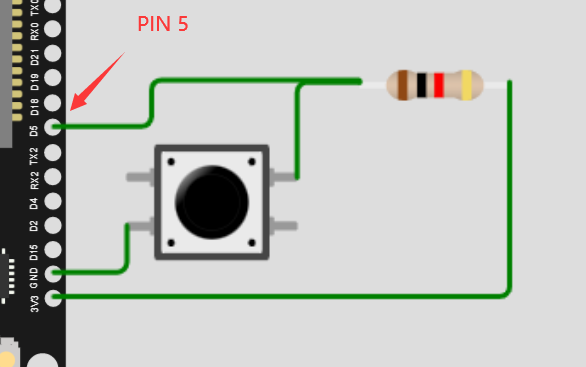

.. _doc_tutorial_basic_05_key:

数字输入——按键控制板载LED的亮灭
========================================

我们将会编写程序，
通过外接按键控制板载的IO LED，
实现按下按钮LED灭、松开按钮LED亮。

这一小节将系统性地介绍：

1. 管脚的初始化、模式设置、数字输入。
2. pinMode()函数的使用。

硬件连接
~~~~~~~~~~~~~~~~~~~~~
外接按键如下图所示。

编写代码
~~~~~~~~~~~~~~~~~~~~

为方便后期查看修改，
我们定义常量来表示 **板载IO LED的GPIO编号** 、
**外接按键的GPIO编号** 
和 **IO LED的状态常量** 。

在最外层添加代码:

::

    const int IO_LED_PIN = 2; // 定义IO LED的GPIO编号
    const int IO_KEY_PIN = 5; // 定义IO KEY的GPIO编号
    int IO_KEY_STATE; // 定义IO KEY的状态常量

然后，
我们在setup初始化函数中，
调用pinMode()函数，
来设置IO LED所属的2号GPIO引脚为 **输出模式**，
按键KEY所接的5号GPIO引脚为 **输入模式**。

::

    pinMode(IO_LED_GPIO,OUTPUT); // 设置引脚模式
    pinMode(IO_KEY_PIN,Input); // 设置按键模式

接着，
我们在loop()函数中，
添加代码来 **读取IO KEY的状态**，
并将 **IO KEY的状态作为LED的输出** ，
从而实现按下按键，IO LED灯灭，松开按键，IO LED灯亮。

::
    
    IO_KEY_STATE = digitalRead(IO_KEY_PIN); // 读取IO KEY电平状态
    digitalWrite(IO_LED_PIN,IO_KEY_STATE); // 将IO KEY状态作为LED的输出

整个程序最后便是：

.. code-block:: arduino
    :linenos:

    const int IO_LED_PIN = 2; // 定义IO LED的GPIO编号
    const int IO_KEY_PIN = 5; // 定义IO KEY的GPIO编号
    int IO_KEY_STATE; // 定义IO KEY的状态常量

    void setup() {
      // 初始化函数
      // 这里的代码将在一开始被执行一次
      pinMode(IO_LED_PIN,OUTPUT); // 设置引脚模式
      pinMode(IO_KEY_PIN,INPUT); // 设置按键模式
   }

   void loop() {
      // 主循环函数
      // 这里的代码将在setup()后被一直循环调用
      IO_KEY_STATE = digitalRead(IO_KEY_PIN); // 读取IO KEY电平状态
      digitalWrite(IO_LED_PIN,IO_KEY_STATE); // 将IO KEY状态作为LED的输出
   }

上传单片机
~~~~~~~~~~~~~~~~~~~