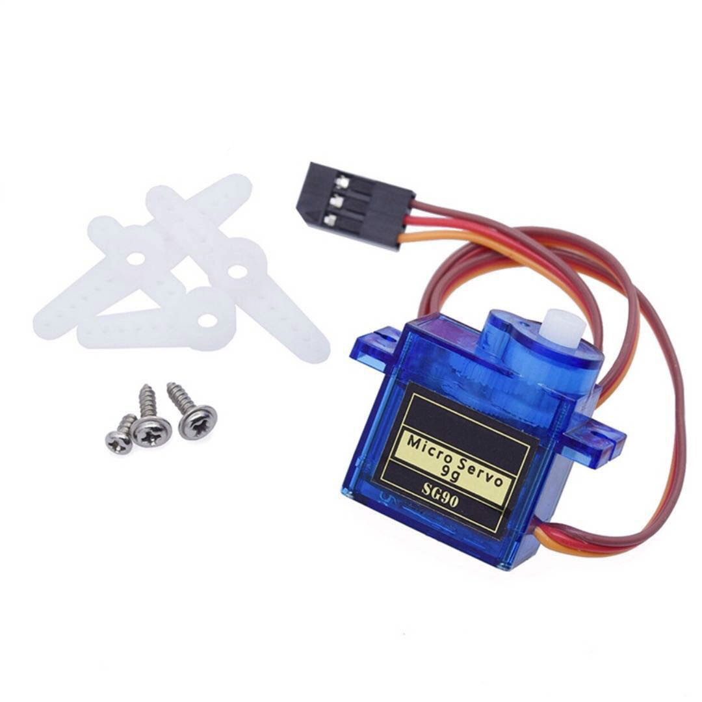
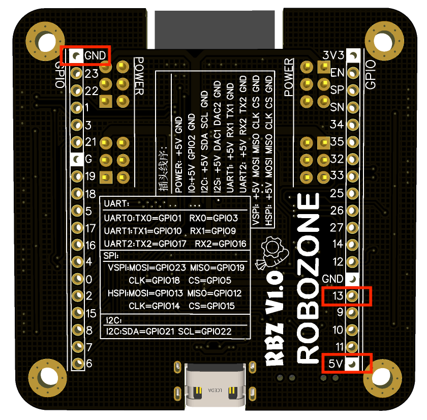

.. _doc_tutorial_basic_07_servo:

.. highlight:: arduino

驱动——伺服电机的输出控制
==================================================

我们将会编写程序，
并学习使用PWM控制伺服电机。

前言
~~~~~~~~~~~~

伺服电机
-------------

伺服电机因其常用于航模控制方向舵变化，也常被称为舵机。
常用的SG90伺服电机，有三个接口，分别是：

- 棕色： GND

- 红色： VCC 4.8-7.2V

- 桔色线： 脉冲输入

棕色接GND；红色接Robozone Board的5v；桔色接GPIO13；

180度电机PWM控制的对应关系：

输入信号脉冲宽度----舵机输出轴转角

0.5ms        ----     0度

1.0ms        ----     45度

1.5ms        ----     90度

2.0ms        ----     135度

2.5ms        ----     180度

.. note:: 
    脉冲宽度调制（英语：Pulse-width modulation，缩写：PWM），
    简称脉宽调制，是将模拟信号变换为脉冲的一种技术，一般变换后脉冲的周期固定，
    但脉冲的工作周期会依模拟信号的大小而改变。简单来说，
    PWM技术是一种对模拟信号电平的数字编码方法，
    通过使用高分辨率计数器（调制频率）调制方波的占空比，
    从而实现对一个模拟信号的电平进行编码。

编写代码
~~~~~~~~~~~~~~~~~~~~~

设置PWM占空比函数的参数。
::

    int freq = 50;      // 1/50秒，50Hz的频率，20ms的周期，这个变量用来存储时钟基准。
    int channel = 8;    // 通道(高速通道（0 ~ 7）由80MHz时钟驱动，低速通道（8 ~ 15）由 1MHz 时钟驱动。)
    int resolution = 8; // 分辨率设置为8，就是2的8次方，用256的数值来映射角度，看下方的占空比函数。

定义占空比函数。
::
        int calculatePWM(int degree) //定义函数用于输出PWM的占空比
        { //0-180度
        //20ms周期内，高电平持续时长0.5-2.5ms，对应0-180度舵机角度，参考上面的180度对应图。
        const float deadZone = 6.4;//对应0.5ms（0.5ms/(20ms/256）)
        const float max = 32;//对应2.5ms（2.5ms/（20ms/256））
        if (degree < 0)
            degree = 0;
        if (degree > 180)
            degree = 180;
        return (int)(((max - deadZone) / 180) * degree + deadZone); //返回度数对应的高电平的数值
        }   

初始化中设置通道频率与分辨率，并将通道与引脚连接。
::
    void setup()
        {
        Serial.begin(9600);
        ledcSetup(channel, freq, resolution); // 用于设置 LEDC 通道的频率和分辨率。
        ledcAttachPin(led, channel);          // 将通道与对应的引脚连接
        }

通过for循环实现伺服电机从0度转至180度，注意需要延时等待伺服电机转至位置。
::
    void loop()
        {
        for (int d = 0; d <= 180; d += 10)
        {
            ledcWrite(channel, calculatePWM(d)); // 输出PWM，设置 LEDC 通道的占空比。
            Serial.printf("value=%d,calcu=%d\n", d, calculatePWM(d));
            delay(1000);
        }  
        }
最后整个程序便是：

.. code-block:: arduino
   :linenos:

         #include <Arduino.h>
        int freq = 50;      // 1/50秒，50Hz的频率，20ms的周期，这个变量用来存储时钟基准。
        int channel = 8;    // 通道(高速通道（0 ~ 7）由80MHz时钟驱动，低速通道（8 ~ 15）由 1MHz 时钟驱动。)
        int resolution = 8; // 分辨率设置为8，就是2的8次方，用256的数值来映射角度，看下方的占空比函数。
        const int led = 13;

        int calculatePWM(int degree) //定义函数用于输出PWM的占空比
        { //0-180度
        //20ms周期内，高电平持续时长0.5-2.5ms，对应0-180度舵机角度，参考上面的180度对应图。
        const float deadZone = 6.4;//对应0.5ms（0.5ms/(20ms/256）)
        const float max = 32;//对应2.5ms（2.5ms/（20ms/256））
        if (degree < 0)
            degree = 0;
        if (degree > 180)
            degree = 180;
        return (int)(((max - deadZone) / 180) * degree + deadZone); //返回度数对应的高电平的数值
        }

        void setup()
        {
        Serial.begin(9600);
        ledcSetup(channel, freq, resolution); // 用于设置 LEDC 通道的频率和分辨率。
        ledcAttachPin(led, channel);          // 将通道与对应的引脚连接
        }

        void loop()
        {
        for (int d = 0; d <= 180; d += 10)
        {
            ledcWrite(channel, calculatePWM(d)); // 输出PWM，设置 LEDC 通道的占空比。
            Serial.printf("value=%d,calcu=%d\n", d, calculatePWM(d));
            delay(1000);
        }  
        }

上传单片机
~~~~~~~~~~~~
