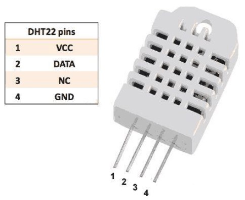
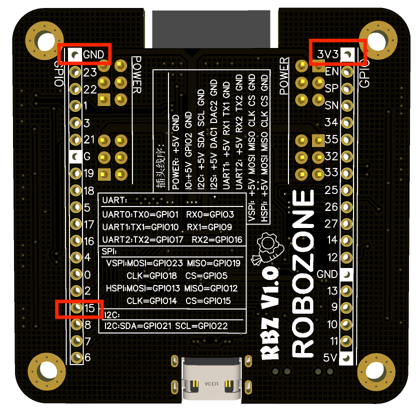
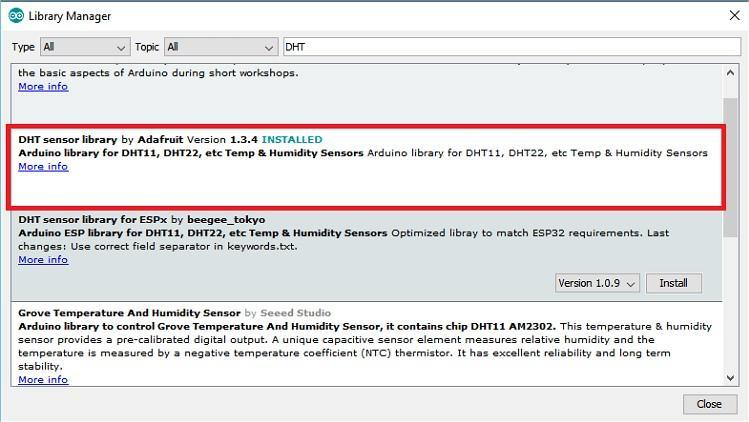
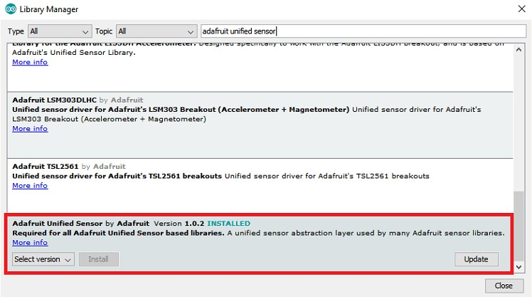

.. _doc_tutorial_basic_08_senseor:

输入采样——DHT22温湿度传感器的使用
==============

我们将会编写程序，
控制外接DHT22温湿度传感器
不断采集环境温度湿度数据。

这一小节将系统性地介绍：

1. DHT22温度传感器的使用。
2. 外部库的安装。
3. 使用DHT22进行输入采样。

前言
~~~~~~~~~~~~~~~~

DHT22温湿度传感器
------------
DHT22数字温湿度传感器，
可用于检测环境温度和湿度，
具有标准的单总线接口。

DHT22测量温湿度的原理，
是通过内置电容式湿度传感器和热敏电阻来测量周围的空气，
取得温度和湿度值后由DATA引脚上向主控板发送一个数字信号。

DHT22是一个四针脚模块，
包含VCC、DATA、NC、GND四个引脚，
实际使用中只会用到VCC、GND、DATA，NC引脚为空脚，
VCC电压范围是3-5V。
DH22引脚定义如下图所示。

RBZBoard外接DHT22，
RBZBoard的 **Vcc接3V3，
DATA接PIN15，
NC悬空，
GND接GND，**
硬件连接图如下。

安装库
------------
要读取DHT传感器，
我们需要使用 **Adafruit的DHT库** 。
要使用此库，
我们需要 **安装Adafruit Unified Sensor库，**
安装步骤如下：

1. 打开Arduino IDE,
转到 “草图” >“ 包含库” >“ 管理库”。
图书馆管理器应打开。

2. 在“搜索”框中搜索“ DHT ”，
然后从Adafruit安装DHT库。

3. 从Adafruit安装DHT库后，
在搜索框中键入“ Adafruit Unified Sensor ”。
一直向下滚动以找到该库并进行安装。

4. 安装库后，重新启动Arduino IDE。

编写代码
~~~~~~~~~

我们首先添加DHTesp头文件，
为后续调用函数做准备。

::

    #include "DHTesp.h" // 引入头文件

然后，
我们需要定义一个整形常量，
来表示 **PIN15接收来自DHT22 DATA的数据**。

所以我们在最外层（setup和loop函数以外）添加代码：

::

    const int DHT_PIN = 15; // 定义PIN15接收来自DHT22 DATA的数据

定义一个DHT传感器。

:: 

    DHTesp dhtSensor; // 定义一个DHT传感器

接着，
我们在setup初始化函数中，
设置串口速率，
将DHT22与GPIO的PIN15关联。

::

    void setup(){
        Serial.begin(115200); // 设置串口速率

        dhtSensor.setup(DHT_PIN, DHTesp::DHT22); // 关联引脚
    }

最后，
我们在loop()函数中，
接收来自传感器的数据，
通过串口显示温度、湿度信息。

::

    void loop(){
        TempAndHumidity  data = dhtSensor.getTempAndHumidity(); // 接收来自传感器的温湿度数据，存入data变量

        Serial.println("Temp: " + String(data.temperature, 2) + "°C"); // 通过串口显示变量的温度信息
        
        Serial.println("Humidity: " + String(data.humidity, 1) + "%"); // 显示湿度信息

        Serial.println("---"); // 定义分隔符

        delay(1000); // 延时1000ms
    }

整个程序最后便是：

::

    #include "DHTesp.h" // 引入头文件

    const int DHT_PIN = 15; // 定义PIN15接收来自DHT22 DATA的数据

    DHTesp dhtSensor; // 定义一个DHT传感器

    void setup() {
        Serial.begin(115200); // 设置串口速率

        dhtSensor.setup(DHT_PIN, DHTesp::DHT22); // 关联引脚
    }

    void loop() {
        TempAndHumidity  data = dhtSensor.getTempAndHumidity(); // 接收来自传感器的温湿度数据，存入data变量

         Serial.println("Temp: " + String(data.temperature, 2) + "°C"); // 通过串口显示变量的温度信息

        Serial.println("Humidity: " + String(data.humidity, 1) + "%"); // 显示湿度信息

        Serial.println("---"); // 定义分隔符

         delay(1000); // 延时1000ms
    }

上传单片机
~~~~~~~~~~
